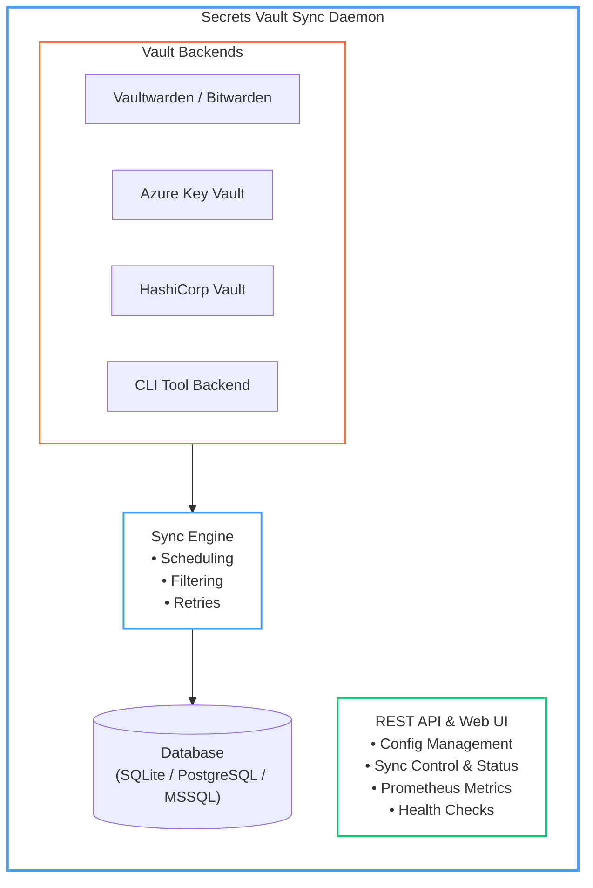

# Secrets Vault Sync

[](https://github.com/pacorreia/vaults-syncer/actions/workflows/go-ci.yml)
[](https://github.com/pacorreia/vaults-syncer/actions/workflows/integration-tests.yml)
[](https://github.com/pacorreia/vaults-syncer/actions/workflows/go-ci.yml)
[](https://github.com/pacorreia/vaults-syncer/releases)
[](https://go.dev/)
[](https://github.com/pacorreia/vaults-syncer/blob/main/LICENSE)

A versatile, multi-vault secret synchronization daemon with OAuth 2.0 support for seamless integration between Vaultwarden, Azure Key Vault, HashiCorp Vault, AWS Secrets Manager, and custom vault backends.

## Features

✨ **Multi-Vault Support**

- Vaultwarden (self-hosted Bitwarden-compatible)
- Bitwarden (cloud or self-hosted)
- HashiCorp Vault (KV v2)
- Azure Key Vault
- AWS Secrets Manager (via CLI tool backend)
- Keeper Secrets Manager
- Generic HTTP-based vaults

🔐 **Flexible Authentication**

- OAuth 2.0 with Vaultwarden support
- Bearer Token
- Basic Authentication
- API Key
- Custom Headers

🔄 **Powerful Sync**

- Unidirectional and bidirectional sync
- Concurrent processing (configurable workers)
- Scheduled execution (cron format)
- Configurable retry policies
- Pattern-based filtering (include/exclude)

📊 **Monitoring & Observability**

- HTTP REST API for operations
- Prometheus metrics export
- Structured JSON logging
- Health check endpoints

🏗️ **Production Ready**

- SQLite, PostgreSQL, or MSSQL state database
- AES-256 encryption of vault credentials at rest
- Transaction support
- Error recovery and retry logic
- Docker & Kubernetes ready
- Built-in Material Design 3 Web UI

## Quick Links

- **[Getting Started](getting-started/index.md)** - New to AKV Sync? Start here
- **[Installation](getting-started/installation.md)** - Setup in 5 minutes
- **[Configuration](configuration/README.md)** - Complete configuration guide
- **[Vaults](configuration/vaults.md)** - Configure your vault connections
- **[Authentication](configuration/authentication.md)** - Set up secure access

## Common Use Cases

### Backup & Replication
Synchronize secrets from your production vault to a backup vault for disaster recovery.

```yaml
syncs:
  - id: prod_to_backup
    source: production
    targets:
      - backup
    sync_type: unidirectional
    schedule: "0 */4 * * *"  # Every 4 hours
```

### Multi-Cloud Deployment
Keep secrets in sync across different cloud providers.

```yaml
syncs:
  - id: aws_to_azure
    source: aws-vault
    targets:
      - azure-vault
    sync_type: bidirectional
```

### Development Environment Sync
Maintain synchronized secrets across dev, staging, and production.

```yaml
syncs:
  - id: to_development
    source: production
    targets:
      - development
      - staging
    filter:
      patterns:
        - "non-prod-*"
        - "shared-*"
```

## Architecture Overview



## Getting Started

### Installation

=== "Docker"

    ```bash
    docker run -d \
      --name vaults-syncer \
      -v sync-data:/app/data \
      -p 8080:8080 \
      -p 9090:9090 \
      ghcr.io/pacorreia/vaults-syncer:latest
    ```

=== "Binary"

    ```bash
    # Download latest release
    wget https://github.com/pacorreia/vaults-syncer/releases/latest/download/sync-daemon-linux-amd64
    chmod +x sync-daemon-linux-amd64
    
    # Set required env vars (key generated on first start)
    export MASTER_ENCRYPTION_KEY=<your-key>
    ./sync-daemon-linux-amd64
    ```

=== "Source"

    ```bash
    git clone https://github.com/pacorreia/vaults-syncer
    cd vaults-syncer
    CGO_ENABLED=1 go build -o sync-daemon .
    export MASTER_ENCRYPTION_KEY=<your-key>
    ./sync-daemon
    ```

### First-Time Setup

After starting the daemon, open `http://localhost:8080` in your browser. The **Setup Wizard** will guide you through:

1. Creating an admin account
2. Adding vault backends (via **Vaults Config**)
3. Defining sync relationships (via **Syncs Config**)
4. Monitoring syncs from the **Dashboard**

Alternatively, configure everything via the admin API:

```bash
# Login
TOKEN=$(curl -s -X POST http://localhost:8080/api/auth/login \
  -H 'Content-Type: application/json' \
  -d '{"username":"admin","password":"your-password"}' | jq -r .token)

# Add vaults and syncs
curl -X POST -H "Authorization: Bearer $TOKEN" \
  http://localhost:8080/api/config/vaults \
  -H 'Content-Type: application/json' \
  -d '{"id":"my-vault","type":"vaultwarden",...}'

# Check health
curl -H "Authorization: Bearer $TOKEN" http://localhost:8080/api/health
```

## Development

This project is written in **Go 1.26** with a modular architecture:

- **Zero backward compatibility compromises** - removed all legacy code paths after generalization
- **Interface-driven design** - pluggable vault backends
- **Production-ready** - comprehensive error handling and retry logic
- **Well-tested** - unit tests, integration tests, and real vault testing

### Build

```bash
# Build with default version (dev)
CGO_ENABLED=1 go build -o sync-daemon .

# Build with complete version information
VERSION=$(git describe --tags --always --dirty)
BUILD_DATE=$(date -u +'%Y-%m-%dT%H:%M:%SZ')
GIT_COMMIT=$(git rev-parse HEAD)

CGO_ENABLED=1 go build \
  -ldflags "-X main.Version=${VERSION} -X main.BuildDate=${BUILD_DATE} -X main.GitCommit=${GIT_COMMIT}" \
  -o sync-daemon .

# Check version
./sync-daemon --version
```

### Test

```bash
# Unit tests
go test ./...

# Integration tests
./e2e/test-integration.sh
```

## Support Us

If you find this project useful, please consider:

- ⭐ Starring the repository
- 🐛 Reporting issues
- 💡 Contributing features
- 📚 Improving documentation

## License

MIT License - See [LICENSE](https://github.com/pacorreia/vaults-syncer/blob/main/LICENSE) for details.

## Contributing

We welcome contributions! Visit [CONTRIBUTING](https://github.com/pacorreia/vaults-syncer/blob/main/CONTRIBUTING.md) for guidelines.
